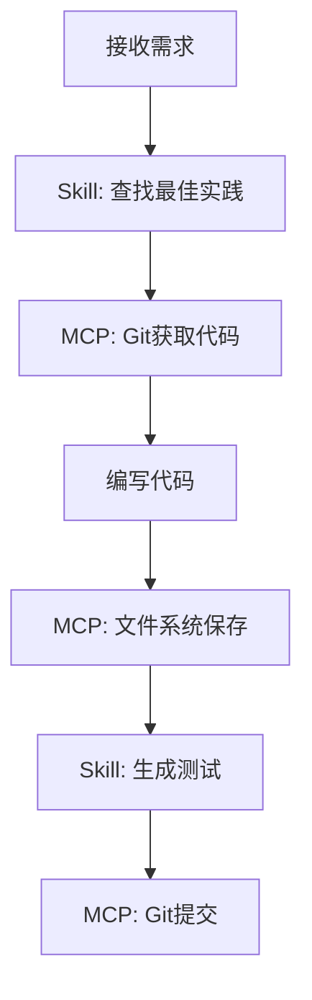

# MCP 与 Skills 集成最佳实践

## 架构设计

```
┌─────────────────────────────────────────┐
│            AI Agent                      │
├─────────────────────────────────────────┤
│  ┌─────────────┐  ┌─────────────────┐ │
│  │   Skills    │  │   MCP Clients   │ │
│  │ (知识/经验)   │  │  (工具/数据)     │ │
│  └─────────────┘  └─────────────────┘ │
└─────────────────────────────────────────┘
         │                  │
         ▼                  ▼
    ┌────────┐        ┌──────────┐
    │Prompt  │        │External  │
    │Library │        │Services  │
    └────────┘        └──────────┘
```

## 组合策略

### 1. 基础组合

```javascript
// 每个 Agent 配置
const agentConfig = {
  skills: [
    "find-skills",           // 技能发现
    "skill-creator",        // 技能创建
  ],
  mcp: {
    filesystem: { path: "/project" },
    git: { repo: "/project/.git" },
    search: { apiKey: process.env.BRAVE_KEY }
  }
};
```

### 2. 前端开发组合

```javascript
const frontendAgent = {
  skills: [
    "vercel-react-best-practices",
    "web-design-guidelines",
    "frontend-design"
  ],
  mcp: [
    { type: "filesystem", config: { path: "./src" } },
    { type: "git", config: {} },
    { type: "github", config: { token: "xxx" } }
  ]
};
```

### 3. 数据分析组合

```javascript
const dataAgent = {
  skills: [
    "pandas-best-practices",
    "data-visualization"
  ],
  mcp: [
    { type: "postgres", config: { connection: "..." } },
    { type: "filesystem", config: { path: "./data" } }
  ]
};
```

## 工作流示例

### 完整开发流程



### 自动化部署

```javascript
// 使用 Skills + MCP 实现部署自动化
async function deployWithAgent(prompt) {
  // 1. 使用 skill 分析部署需求
  const plan = await agent.executeSkill("azure-deploy", prompt);
  
  // 2. 使用 MCP 获取配置
  const config = await mcp.filesystem.read("/app/config.yaml");
  
  // 3. 执行部署
  await mcp.execute("azure", { action: "deploy", ...config });
  
  // 4. 验证结果
  return await mcp.execute("azure", { action: "verify" });
}
```

## 性能优化

### 1. 缓存 Skills 结果

```javascript
const skillsCache = new Map();

async function executeSkill(skillName, prompt) {
  const cacheKey = `${skillName}:${prompt}`;
  
  if (skillsCache.has(cacheKey)) {
    return skillsCache.get(cacheKey);
  }
  
  const result = await agent.executeSkill(skillName, prompt);
  skillsCache.set(cacheKey, result);
  return result;
}
```

### 2. MCP 连接池

```javascript
const mcpPool = {
  filesystem: null,
  git: null,
  
  async getConnection(type) {
    if (!this[type]) {
      this[type] = await createMCPConnection(type);
    }
    return this[type];
  }
};
```

### 3. 并行执行

```javascript
async function parallelExecute(tasks) {
  return Promise.all(
    tasks.map(task => agent.execute(task))
  );
}
```

## 监控与调试

### 日志配置

```javascript
const logging = {
  skills: {
    enabled: true,
    logFile: "./logs/skills.log"
  },
  mcp: {
    enabled: true,
    logFile: "./logs/mcp.log"
  }
};
```

### 成本追踪

```javascript
const costTracker = {
  skills: new Map(),
  mcp: new Map(),
  
  track(type, name, tokens) {
    const key = `${type}:${name}`;
    this[type].set(key, (this[type].get(key) || 0) + tokens);
  },
  
  report() {
    return {
      skills: Object.fromEntries(this.skills),
      mcp: Object.fromEntries(this.mcp)
    };
  }
};
```

## 安全最佳实践

### 1. 敏感数据处理

```javascript
// 不在代码中硬编码敏感信息
const secureConfig = {
  apiKeys: process.env,  // 使用环境变量
  mcp: {
    github: { token: process.env.GITHUB_TOKEN }  // 外部传入
  }
};
```

### 2. 权限控制

```javascript
const permissions = {
  filesystem: {
    allowedPaths: ["./src", "./config"],
    readonly: ["node_modules", ".git"]
  },
  network: {
    allowedDomains: ["api.github.com", "api.openai.com"]
  }
};
```

### 3. 审计日志

```javascript
const auditLog = (action, details) => {
  console.log(`[AUDIT] ${new Date().toISOString()} - ${action}`, details);
};
```

---

*集成最佳实践 v1.0*
